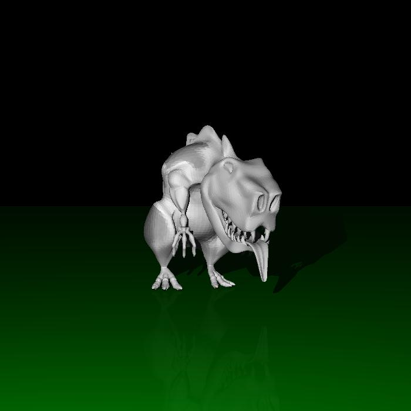
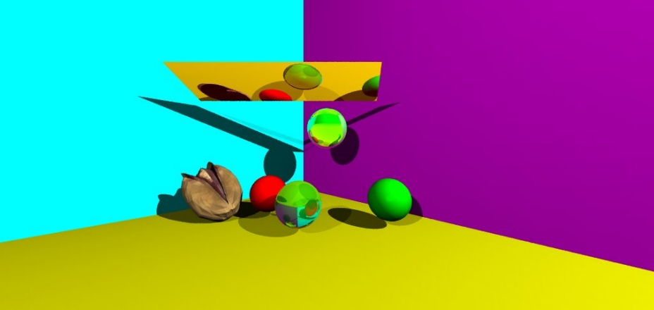

# Ray Tracer

This repository contains a graphic generator which creates different shapes and emulates the light over all the objects in the scene. 
These objects are spheres, planes, triangles and, objects built with multiples triangles.
These objects can also be opaque or translucent.

The light simulated is the set of the ambiental light, diffuse light, specular light, reflected light and, refracted light.

To improve the final result, the scene is rendered applying anti-aliasing.

These images are an example of the result obtained with this program:

 
 
